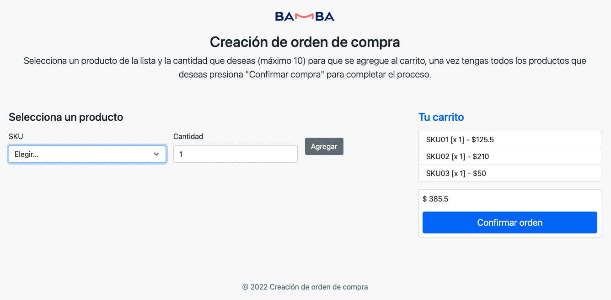
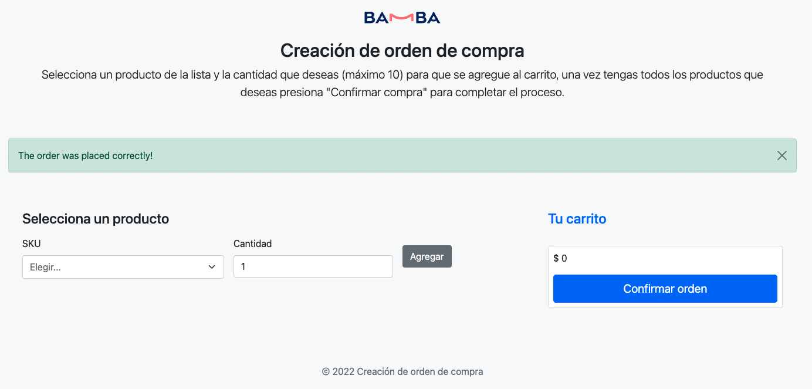

## ¿Como ejecutar el proyecto?

El proyecto pensado para ser ejecutado mediante Laravel Sail por mas conveniencia. Si no tiene Docker en su equipo refierase a la [documentacion](https://laravel.com/docs) de Laravel para encontrar la forma mas conveniente segun su entorno.
## Pasos para ejecutar el proyecto en local

Clonar el proyecto

```git clone git@github.com:jfreites/purchase-form.git```

Ejecutar Sail para preparar el entorno local

```./vendor/bin/sail up```

Revisar que todo este OK visitando [http://localhost:8888](http://localhost:8888/)

Una vez esten los container creados vamos a migrar la DB

```./vendor/bin/sail artisan migrate```

Creemos algunos productos para poder crear ordenes de compra

```./vendor/bin/sail artisan db:seed```

El formulario esta disponible en [http://localhost:8888/purchase-order/create](http://localhost:8888/purchase-order/create)

Para ejecutar las pruebas

```./vendor/bin/sail artisan test```

## Screenshot





## Consideraciones

Ciertas decisiones de implementación y practicas fueron pensadas para el contexto del caso de uso solicitado. En proyectos más complejos otras direcciones pudieron haberse tomado. 

## Librerias adicionales usadas en el proyecto

[https://getbootstrap.com/](https://getbootstrap.com/)
[https://github.com/orchidjs/tom-select](https://github.com/orchidjs/tom-select)
